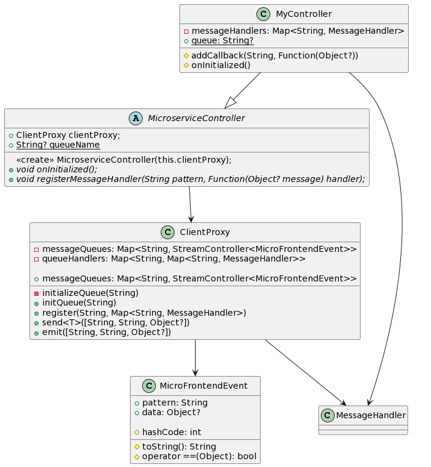

# Microfrontends with Dart

With "micro_frontends", you can split your frontend application into independent, interconnected modules using a microservices communication infrastructure. The package includes tools for development, testing, and deployment of your micro frontends, allowing you to work more efficiently and improve the quality of your software.

This README will guide you through the process of creating a simple microfrontend architecture using Dart. We will cover the following topics:

- [1. Requirements](#1-requirements)
- [2. What are the microfrontends we just created?](#2-what-are-the-microfrontends-we-just-created-)
- [3. Queues and patterns in microfrontends](#3-queues-and-patterns-in-microfrontends)
  * [Queues](#queues)
  * [Patterns](#patterns)
- [4. How they work](#4-how-they-work)
- [5. Implementation example](#5-implementation-example)
- [6. Flow example diagram](#6-flow-example-diagram)
- [7. UML diagram](#7-uml-diagram)

## 1. Requirements

- Dart SDK: Version 2.12 or later

## 2. What are the microfrontends we just created?

We have created a lightweight and flexible microfrontend architecture using Dart. The architecture consists of the following classes:

- `ClientProxy`: This class is responsible for sending messages and emitting events between different microfrontend components.
- `MicroserviceController`: An abstract class that should be extended by your specific microfrontend controllers.
- `MyController`: A sample implementation of a `MicroserviceController`.
- `MicroFrontendEvent`: A class representing an event in the microfrontend architecture.

## 3. Queues and patterns in microfrontends

In the context of microfrontends, queues and patterns are essential concepts to understand.

### Queues

Queues are used to manage the communication between different microfrontends. In this architecture, a queue represents a named communication channel that allows microfrontend components to send and receive messages. Queues help decouple the components, allowing them to evolve independently while still being able to communicate with each other.

### Patterns

Patterns are used to specify how messages should be handled in a microfrontend architecture. In our implementation, patterns are strings that represent different types of messages or events. When a message is sent or an event is emitted, the pattern determines which registered handler in the receiving microfrontend should be called to process the message. By using patterns, we can create a flexible and extensible system for handling various types of messages between microfrontends.

## 4. How they work

The main components of this architecture are `ClientProxy` and the microfrontend controllers that extend `MicroserviceController`. The communication between these components is done through message queues and pattern-based event handling.

## 5. Implementation example

Here is an example of how to implement and use the microfrontend system we've created, using the enums `MicroFrontendsQueue` and `AuthenticationModule` to define the queue name and patterns:

1. Define the `MicroFrontendsQueue` and `AuthenticationModule` enums:

```dart
enum MicroFrontendsQueue {
  account('account'),
  app_cross('app-cross'),
  // ...
  authentication('authentication');

  const MicroFrontendsQueue(this.name);

  final String name;

  @override
  String toString() => '${name}_queue';
}

enum AuthenticationModule {
  nav_to_auth('find-auth-main-path'),
  nav_to_signin('find-signin-main-path'),
  nav_to_signup('find-signup-main-path'),
  // ...
  find_otp_path('find-otp-view-path');

  const AuthenticationModule(this.name);

  final String name;

  @override
  String toString() => '@authentication/$name';
}
```

2. Define a controller that extends `MicroserviceController`:

```dart
class MyController extends MicroserviceController {
  MyController(ClientProxy clientProxy) : super(clientProxy);

  static String queue = MicroFrontendsQueue.authentication.toString();

  @override
  void onInitialized() {
    // Register message handlers here
    registerMessageHandler(AuthenticationModule.nav_to_auth.toString(), (Object? message) => 'Received: $message');
  }
}
```

3. Instantiate `ClientProxy` and `MyController` in `main.dart`:

```dart
void main() {
  ClientProxy clientProxy = ClientProxy();
  MyController myController = MyController(clientProxy);

  myController.onInitialized();
}
```

4. Send a message and receive a response using `ClientProxy.send()`:

```dart
void main() async {
  ClientProxy clientProxy = ClientProxy();
  MyController myController = MyController(clientProxy);

  myController.onInitialized();

  String response = await clientProxy.send<String>(
    MicroFrontendsQueue.authentication.toString(),
    AuthenticationModule.nav_to_auth.toString(),
    'Hello, microservices!',
  );

  print(response); // Output: 'Received: Hello, microservices!'
}
```

5. Emit an event using `ClientProxy.emit()`:

```dart
void main() {
  ClientProxy clientProxy = ClientProxy();
  MyController myController = MyController(clientProxy);

  myController.onInitialized();

  clientProxy.emit(
    MicroFrontendsQueue.authentication.toString(),
    AuthenticationModule.nav_to_auth.toString(),
    'Hello, microservices!',
  );
}
```

These examples will help you understand how to use the microfrontend system we've created, using enums for better organization and readability of the code.

## 6. Flow example diagram

Let's assume we have three controllers: `ControllerA`, `ControllerB`, and `ControllerC`. These controllers communicate with each other using the `send` and `emit` methods of the `ClientProxy` class.

1. `ControllerA` sends a message to `ControllerB` and waits for a response.
2. `ControllerB` receives the message and processes the request.
3. `ControllerB` sends a message to `ControllerC` without waiting for a response.
4. `ControllerC` receives the message and performs some action based on the message.
5. `ControllerB` responds to the original message sent by `ControllerA`.
6. `ControllerA` receives the response and performs some action based on the response.

Here's a flowchart representing this process:

```lua
  +------------+       +------------+       +------------+
  | ControllerA|       | ControllerB|       | ControllerC|
  +-----+------+       +------+-----+       +------+-----+
        |                    |                     |
        |send (message1)     |                     |
        +------------------->|                     |
        |                    |                     |
        |                    |process message1     |
        |                    |                     |
        |                    |emit (message2)      |
        |                    +-------------------> |
        |                    |                     |
        |                    |      process        |
        |                    |      message2       |
        |                    |                     |
        |                    |                     |
        |     response1      |                     |
        +<-------------------+                     |
        |                    |                     |
        | process response1  |                     |
        |                    |                     |
  +-----+------+       +------+-----+       +------+-----+
  | ControllerA|       | ControllerB|       | ControllerC|
  +------------+       +------------+       +------------+

```

This diagram shows how the controllers communicate with each other using the `ClientProxy` class and its `send` and `emit` methods. You can adapt this example to your own needs and add more details as needed.
## 7. UML diagram

Here's a uml representing this project:



```lua
@startuml
abstract class MicroserviceController {
  <<create>> MicroserviceController(this.clientProxy);
  + ClientProxy clientProxy;
  {static} + String? queueName
  {abstract} + void onInitialized();
  {abstract} + void registerMessageHandler(String pattern, Function(Object? message) handler);
}

class MyController {
    - messageHandlers: Map<String, MessageHandler>
    {static} + queue: String?

    # addCallback(String, Function(Object?))
    # onInitialized()
}

class MicroFrontendEvent{
    + pattern: String
    + data: Object?

    # toString(): String
    # hashCode: int
    # operator ==(Object): bool
}

class ClientProxy {
    - messageQueues: Map<String, StreamController<MicroFrontendEvent>>
    - queueHandlers: Map<String, Map<String, MessageHandler>>

    - initializeQueue(String)
    + initQueue(String)
    + register(String, Map<String, MessageHandler>)
    + send<T>([String, String, Object?])
    + emit([String, String, Object?])
    + messageQueues: Map<String, StreamController<MicroFrontendEvent>>
}


MyController --|> MicroserviceController
MicroserviceController -[plain]-> ClientProxy
MyController --> MessageHandler 
ClientProxy --> MicroFrontendEvent
ClientProxy --> MessageHandler
@enduml

```


UML made with [plantUML](https://www.plantuml.com/)